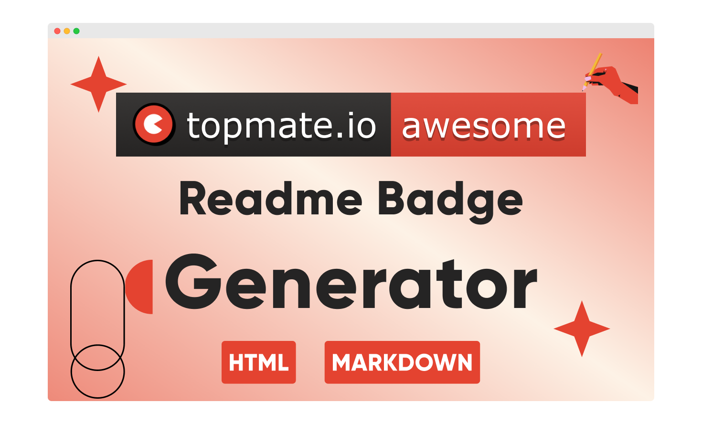

<h1 align="center">
   Topmate <code>README</code> Badge <br>
   <a href="https://topmate.io/vinitshahdeo">
   
   </a>
</h1>



<div align='center'>
   
   <a href="https://www.postman.com/restless-rocket-22186/workspace/topmate-readme-badges-api/documentation/6178851-c863d626-b2e3-49bf-82d0-4e4cb46a089c">
    
   </a>
   <a href="https://topmate-readme-badge.netlify.app/">
    
   </a>
   <a href="https://app.netlify.com/sites/topmate-readme-badge/deploys">
    
   </a>
   <a href="https://github.com/vinitshahdeo/topmate-readme-badge/blob/main/LICENSE">
    
   </a>
   <a href="https://github.dev/vinitshahdeo/topmate-readme-badge/">
    
   </a>
   <a href="https://github.com/vinitshahdeo">
    
   </a>
   <a href="https://github.com/vinitshahdeo/peerlist-readme-badge/fork">
    
   </a>
   <a href="https://vinitshahdeo.dev/">
    
   </a>
   <a href="https://twitter.com/Vinit_Shahdeo">
    
   </a>
   <br />
   <br />
</div>

<div align="center">

Topmate is a platform to connect 1:1 with your audience & monetise your time better. Basically, one link to do it all ➥ [topmate.io/vinitshahdeo](https://topmate.io/vinitshahdeo). Even better, you can now **add a markdown badge** in your GitHub profile `README` to connect with your community! If you haven't claimed your topmate link yet, visit [topmate.io](https://topmate.io/) to join 1000+ creators, experts and mentors creating impact with their time.

<a href="https://www.producthunt.com/posts/topmate-io-readme-badge-generator?utm_source=badge-featured&utm_medium=badge&utm_souce=badge-topmate&#0045;io&#0045;readme&#0045;badge&#0045;generator" target="_blank"></a> <a href="https://www.producthunt.com/posts/topmate-io-readme-badge-generator?utm_source=badge-top-post-topic-badge&utm_medium=badge&utm_souce=badge-topmate&#0045;io&#0045;readme&#0045;badge&#0045;generator" target="_blank"></a>
   
**Try now: [topmate-readme-badge.netlify.app](https://topmate-readme-badge.netlify.app/)**
   
</div>


## Here's how?
Replace `vinitshahdeo` in the markdown with your Topmate username. **[Claim your Topmate link](https://topmate.io/) if you haven't yet!**

```markdown
[](https://topmate.io/vinitshahdeo)
```
[](https://topmate.io/vinitshahdeo)

➥ **Try it out here**: [topmate-readme-badge.netlify.app](https://topmate-readme-badge.netlify.app/) *<sup>(Best viewed in Desktop)</sup>*

> <sup>**Note**: In case, you're facing issues in accessing the badge using the above API which is deployed on Heroku. This happens once the monthly free dynos hours are exhausted. In such cases, consider using the service hosted on Render. Please replace the base URL from `https://topmate-readme-badge.herokuapp.com` to `https://topmate-readme-badge.onrender.com`.</sup>

## Style your badge 💅

Additionally it supports the styles. **To use a different style**: Replace `flat-square` in the markdown with any of the styles below ⤵

```markdown

```

### Available styles

| Type  | Badge  |
|:---|:---|
| `flat` <br> <sub>This is the default style.<sub>  |  |
| `flat-square`  |   |
| `plastic`  |   |
| `social`  |   |
| `for-the-badge`  |   |

## Setup

```console
npm install
npm start
```

Run the above command and visit `http://localhost:3000/`

## API Documentation
   
[](https://god.gw.postman.com/run-collection/6178851-c863d626-b2e3-49bf-82d0-4e4cb46a089c?action=collection%2Ffork&collection-url=entityId%3D6178851-c863d626-b2e3-49bf-82d0-4e4cb46a089c%26entityType%3Dcollection%26workspaceId%3Ddfda0a54-561a-45a8-b795-18038b8fd159#?env%5Btopmate%5D=W3sia2V5IjoiYmFzZVVybCIsInZhbHVlIjoiaHR0cHM6Ly90b3BtYXRlLXJlYWRtZS1iYWRnZS5oZXJva3VhcHAuY29tIiwiZW5hYmxlZCI6dHJ1ZSwidHlwZSI6ImRlZmF1bHQifV0=)

`GET baseUrl/:username` - please refer to the [Topmate README Badges public Postman collection](https://www.postman.com/restless-rocket-22186/workspace/topmate-readme-badges-api/documentation/6178851-c863d626-b2e3-49bf-82d0-4e4cb46a089c) for the API documentation. Please feel free to fork and use! You can directly run the collection in Postman by using the **Run in Postman** button above.

## Under the hood
  

  
The badges are powered by an express app deployed on Heroku. These are generated using a tiny-service written by me: [topmate.js](https://github.com/vinitshahdeo/topmate-readme-badge/blob/main/services/topmate.js)
  
```js
topmate
  .generateBadge(username, style)
  .then((badge) => {
    // here is your badge
  })
  .catch(console.log);
```

> Huge shoutout to [Shields.io](https://shields.io/) service for providing badges in the SVG format.

### Topmate `README` Badge Generator

[](https://app.netlify.com/sites/topmate-readme-badge/deploys)

> The react app is available inside the `client/` directory in the `feature/web-app`. This is currently deployed using Netlify. Try it our here: [topmate-readme-badge.netlify.app](https://topmate-readme-badge.netlify.app/)

Run the commands below to build locally 👇

```bash
git checkout feature/web-app
cd client/topmate-readme-badge
npm install
npm start
```

## Contributing

This project is also open for the [Hacktoberfest](https://hacktoberfest.com/) participants. Please check out the open [issues](https://github.com/vinitshahdeo/topmate-readme-badge/issues). **Your contributions are most welcome!**


[](https://github.com/vinitshahdeo/topmate-readme-badge/network/members)

## Similar projects

Peerlist is a community of working professionals focused on building a personal brand, sharing professional content, and finding peers to collaborate with. A [Peerlist profile](https://peerlist.io/vinitshahdeo) can be used as a simple resume or a complete portfolio to showcase your work. You can style your `README.md` with an awesome Peerlist markdown badge.

[](https://peerlist.io/vinitshahdeo) [](https://www.postman.com/restless-rocket-22186/workspace/peerlist-readme-badges/collection/6178851-67cf0bab-e978-4a37-b3ad-a5b3b42bf69e)

Here's `markdown` badge generator for any Peerlist profile 💚 
➥ [peerlist-readme-badge](https://github.com/vinitshahdeo/peerlist-readme-badge)

[](https://github.com/vinitshahdeo/peerlist-readme-badge)

## Sponsor

The service stops running once 550 free dyno hours on Heroku are exhausted. **[Consider sponsoring](https://github.com/sponsors/vinitshahdeo/) :dollar: me in order to keep this running by upgrading to [Hobby dynos](https://www.heroku.com/pricing) for $7 per dyno per month**. The service will never sleep and you will get 24/7 access to the awesome Topmate.io badges.

[](https://github.com/sponsors/vinitshahdeo/)

## Author

[](https://github.com/vinitshahdeo)

## Acknowledgement

- My gratitude to [Yashvi](https://github.com/yashvi2001) for helping me in building [React app](https://topmate-readme-badge.netlify.app/). Thanks for the [contributions](https://github.com/vinitshahdeo/topmate-readme-badge/pulls?q=is%3Apr+is%3Aclosed+author%3Ayashvi2001).

- Special thanks to [Tejasvi](https://github.com/TejasviArora) for designing the [Figma mocks](https://www.figma.com/file/DGSis1DiZrULEiWydKtpJb/Peerlist?node-id=89%3A6).

## Stargazers :heart:

[](https://github.com/vinitshahdeo/topmate-readme-badge/stargazers)

## Are you a student?

With the placement season around the corner and the internship season already started in many colleges, I would like to make myself available to help students in their prep. Since I have been through this phase, I know that this period can be extremely challenging, not to mention mentally exhausting. So I am opening my slots on [topmate.io](https://topmate.io/vinitshahdeo) to help and guide in whatever ways I can. **Find me here: [topmate.io/vinitshahdeo](https://topmate.io/vinitshahdeo)**

<a href="https://topmate.io/vinitshahdeo">
   
</a>

## Support

Glad to see you here! Let me briefly tell you what has motivated me to build this ⤵

[](https://github.com/vinitshahdeo/)
   
A lot has changed over the years, from being mentored to mentoring. I've always believed in [giving back to the community](https://vinitshahdeo.dev/mentorship-mock-interviews-and-giving-back-to-the-community), and Topmate has made it easy for me to connect with my mentees - [topmate.io/vinitshahdeo](https://topmate.io/vinitshahdeo). I made this tiny-service to produce `README` badges for my GitHub repositories, which will help me engage with the **open-source** community.

[](https://vinitshahdeo.dev/mentorship-mock-interviews-and-giving-back-to-the-community)
   
Did you love it? Consider giving a :star: and share it with your friends! You can also find me on [Twitter](https://twitter.com/Vinit_Shahdeo) ⏎

<a href="https://www.buymeacoffee.com/vinitshahdeo" target="_blank"></a>

